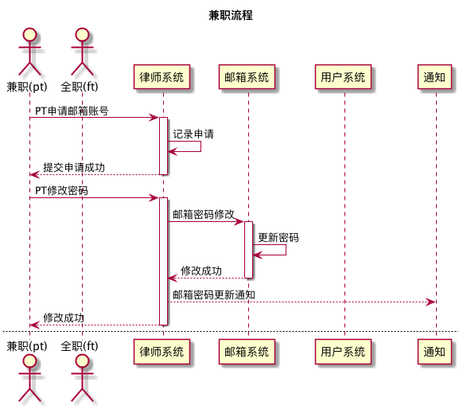
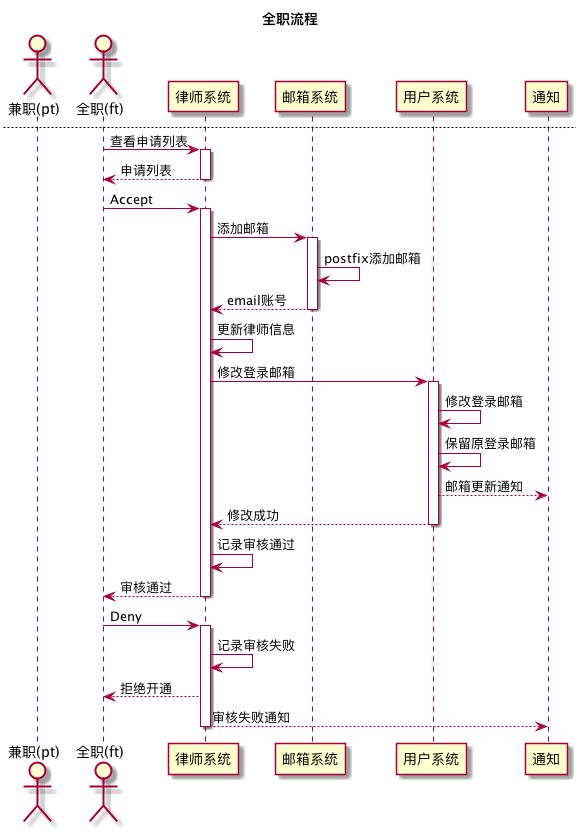

# self-build mailbox service

## refs

* [Postfix](http://www.postfix.org/)
* [Dovecot](https://www.dovecot.org/)
* [从零开始](http://www.jianshu.com/p/610d9bf0ae8b)
* [提高送达率](http://lomu.me/post/SPF-DKIM-DMARC-PTR)

## prepare

* 设置hostname
* 开放防火墙端口 `25, 465, 587, 110, 995, 143, 993`
* 域名解析

## design

------

